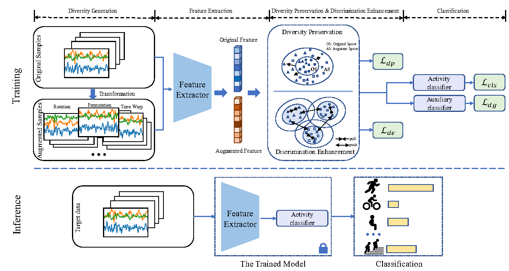

# Generalizable Low-Resource Activity Recognition with Diverse and Discriminative Representation Learning

This project implements our paper [Generalizable Low-Resource Activity Recognition with Diverse and Discriminative Representation Learning](https://arxiv.org/abs/2306.04641). Please refer to our paper [1] for the method and technical details. 




**Abstract:** Human activity recognition (HAR) is a time series classification task that focuses on identifying the motion patterns from human sensor readings. Adequate data is essential but a major bottleneck for training a generalizable HAR model, which assists customization and optimization of online web applications. However, it is costly in time and economy to collect large-scale labeled data in reality, i.e., the low-resource challenge. Meanwhile, data collected from different persons have distribution shifts due to different living habits, body shapes, age groups, etc. The low-resource and distribution shift challenges are detrimental to HAR when applying the trained model to new unseen subjects. In this paper, we propose a novel approach called Diverse and Discriminative representation Learning (DDLearn) for generalizable low-resource HAR. DDLearn simultaneously considers diversity and discrimination learning. With the constructed self-supervised learning task, DDLearn enlarges the data diversity and explores the latent activity properties. Then, we propose a diversity preservation module to preserve the diversity of learned features by enlarging the distribution divergence between the original and augmented domains. Meanwhile, DDLearn also enhances semantic discrimination by learning discriminative representations with supervised contrastive learning. Extensive experiments on three public HAR datasets demonstrate that our method significantly outperforms state-of-art methods by an average accuracy improvement of 9.5% under the low-resource distribution shift scenarios, while being a generic, explainable, and flexible framework.


## Requirement

The required packages are listed in `requirements.txt` for minimum requirement (Python 3.8.5):

```
$ pip install -r requirements.txt
$ pip install torch==1.7.1+cu110 torchvision==0.8.2+cu110 torchaudio==0.7.2 -f https://download.pytorch.org/whl/torch_stable.html
```

## Dataset 
DSADS. UCI Daily and Sports Data Set collects data from 8 subjects around 1.14M samples. Three kinds of body-worn sensor units including triaxial accelerometer, triaxial gyroscope, and triaxial magnetometer are worn on 5 body positions of each subject: torso, right arm, left arm, right leg, and left leg. It consists of 19 activities. The total signal duration is 5 minutes for each activity of each subject.

In the following links are data(100% propotion of training data with seed=1 as examples, you can random sample different propotion from the training data to simulate the low-resource regime) after preprocessing according to the paper. You can get different propotion of training data with the 100% data.

```
wget https://wjdcloud.blob.core.windows.net/dataset/qxx/kdd-act-dsads/dsads_crosssubject_rawaug_rate1.0_t0_seed1_scalerminmax.pkl 
wget https://wjdcloud.blob.core.windows.net/dataset/qxx/kdd-act-dsads/dsads_crosssubject_rawaug_rate1.0_t1_seed1_scalerminmax.pkl 
wget https://wjdcloud.blob.core.windows.net/dataset/qxx/kdd-act-dsads/dsads_crosssubject_rawaug_rate1.0_t2_seed1_scalerminmax.pkl 
wget https://wjdcloud.blob.core.windows.net/dataset/qxx/kdd-act-dsads/dsads_crosssubject_rawaug_rate1.0_t3_seed1_scalerminmax.pkl 
```

## How to run

We provide the commands for four tasks (100% training data) in DSADS to reproduce the results, change the root_path and save_path as your path.

```
python main.py --num_workers 1 --root_path ../data/ --seed 1 --dataset_name 'dsads' --target 0 --n_act_class 19 --n_aug_class 8 --auglossweight 1.0 --conweight 1.0 --dp 'dis' --dpweight 10.0 --n_feature 64 --remain_data_rate 1.0 --save_path ../results/
```

```
python main.py --num_workers 1 --root_path ../data/ --seed 1 --dataset_name 'dsads' --target 1 --n_act_class 19 --n_aug_class 8 --auglossweight 0.1 --conweight 0.1 --dp 'dis' --dpweight 10.0 --n_feature 64 --remain_data_rate 1.0 --save_path ../results/
```

```
python main.py --num_workers 1 --root_path ../data/ --seed 1 --dataset_name 'dsads' --target 2 --n_act_class 19 --n_aug_class 8 --auglossweight 0.01 --conweight 0.1 --dp 'dis' --dpweight 0.1 --n_feature 64 --remain_data_rate 1.0 --save_path ../results/
```

```
python main.py --num_workers 1 --root_path ../data/ --seed 1 --dataset_name 'dsads' --target 3 --n_act_class 19 --n_aug_class 8 --auglossweight 1.0 --conweight 5.0 --dp 'dis' --dpweight 1.0 --n_feature 64 --remain_data_rate 1.0 --save_path ../results/
```

## Results

**DSADS**

| Source   | 1,2,3      | 0,2,3      | 0,1,3      | 0,1,2      | AVG        |
|----------|------------|------------|------------|------------|------------|
| Target   |0           | 1          | 2          | 3          | -          |
| ERM      | 63.28      | 60.94      | 64.40      | 71.54      | 65.04      |
| Mixup    | 84.26      | 82.48      | 85.16      | 81.25      | 83.29      |
| Mldg     | 72.99      | 69.53      | 73.21      | 72.32      | 72.01      |
| RSC      | 65.40      | 80.25      | 76.79      | 75.11      | 74.39      |
| AND-Mask | 78.35      | 70.76      | 84.15      | 65.51      | 74.69      |
| SimCLR   | 72.54      | 75.65      | 77.08      | 73.83      | 74.78      |
| Fish     | 62.05      | 65.85      | 77.01      | 74.22      | 69.78      |
| DDLearn  | **93.81**  | **93.15**  | **92.49**  | **88.62**  | **92.02**  |


## Contact

- qinxin@ict.ac.cn
- jindongwang@outlook.com

## References

```
@article{qin2023generalizable,
  title={Generalizable Low-Resource Activity Recognition with Diverse and Discriminative Representation Learning},
  author={Qin, Xin and Wang, Jindong and Ma, Shuo and Lu, Wang and Zhu, Yongchun and Xie, Xing and Chen, Yiqiang},
  journal={KDD},
  year={2023}
}
```